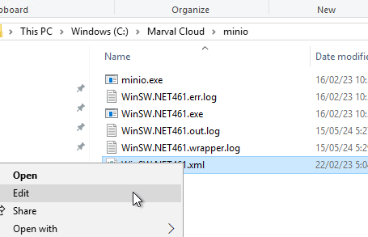
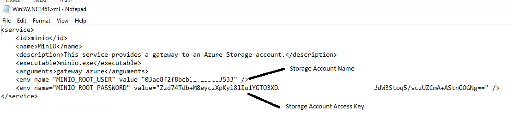
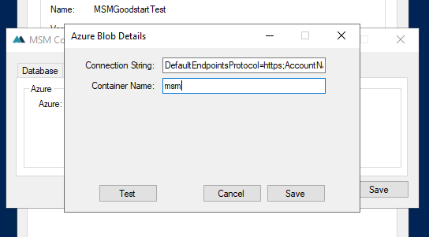

# AzureMoveToAzureS3
A script for current customers who are using minion to move them from using Azure/Minio to pure Azure to store attachments

This script is loosely based on this script here https://bitbucket.org/marvalsoftware/aws-scripts/src/master/Migration/.

**History**
Previously, Marval did not surpport Azure attachmnets so we started using a program called Minio to store attachments in Azure and translate them using Minio, which allowed us to use an 'S3 endpoint' pointing to Minio, which would then translate these attachments into Azure.
This is no longer required and we are able to use Azure natively from Marval, since Marval now suports Azure natively.
In addition to the new support, Minio no longer supports Azure, so we are on an old unsupported version of Minio.

  
To configure Marval to use Azure, you use the following format.
DefaultEndpointsProtocol=https;AccountName=_accountname_;AccountKey=_accountkey_;EndpointSuffix=core.windows.net

 _accountname_ is the Storage Account Name  _accountkey_ is the Storage Account Access key

 The other required item is Container Name, this is normally msm, however it may not be and is accessed by navigating to your Container, navigating to Containers under Data storage. The Container Name will then be listed there.

**Procedure**

You can follow the procedure below to convert the attachments over.

First you will need to find where the existing storage account is in Azure. To do this, open the Minio configuration. If you cannot find the file below, locate where Minio is running from by using Windows Services and locating the executable. The file below will be in the same location.

In here you will find the storage account information as per the image below.

You can then use this in the Marval configuration, this is required prior to running the script to ensure that the customer will be able to access attachments as the connection string is converted over.

The Connection String format is listed above, this customer connection string is as follows with some ifnormation ommited with ... for security.
DefaultEndpointsProtocol=https;AccountName=03ae8f2f8........3533;AccountKey=Zzd74Td....ABo2dW3Sto...zUZCmA+AStnGOGNg==;EndpointSuffix=core.windows.net

The values in Minio are also then used to construct the command to convert the connections strings across to Azure format as per the example below.

.\ConvertToAzureFromS3Azure.ps1 -containerName "03ae8f2f8........3533" -dbServer "marvalaucloud.database.windows.net" -dbName "MSMGoodStartTest" -dbUser "_dbusername_" -dbPassword "_dbpassword_" -tables "queuedNotification"

To view the progress of the script, you can run the following queries (for each relevant table).
These queries will give the number of rows remaining to copy.

SELECT count(*) FROM queuedNotification WHERE externalStorageProvider like '%S3%'

SELECT count(*)  FROM attachment WHERE externalStorageProvider like '%S3%'

SELECT count(*) FROM note WHERE externalStorageProvider like '%S3%'

SELECT count(*)  FROM richTextImage WHERE externalStorageProvider like '%S3%'